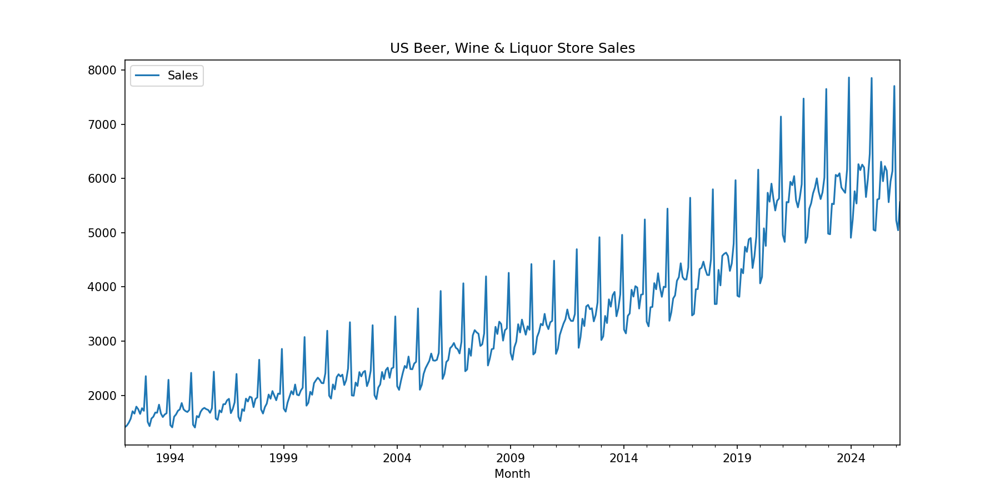
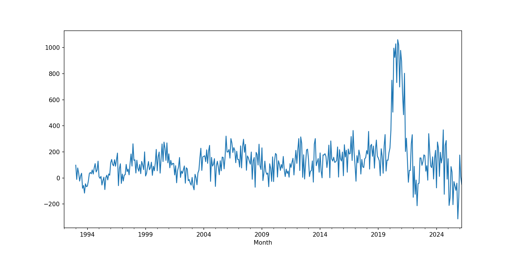
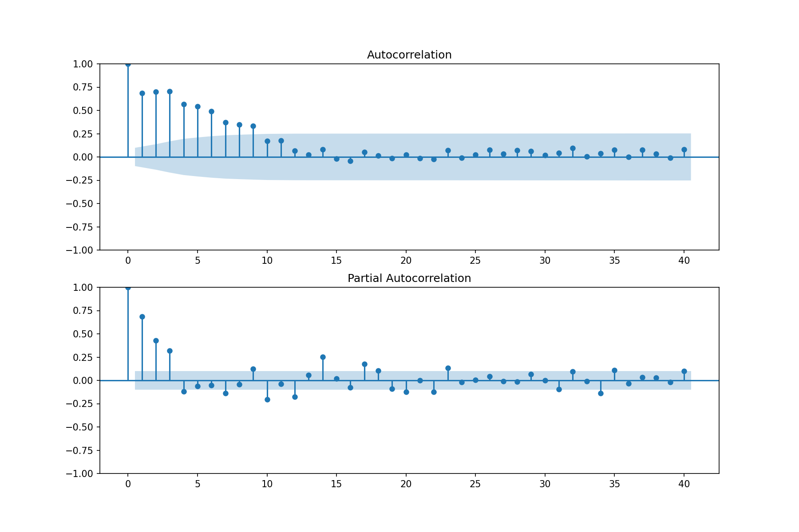
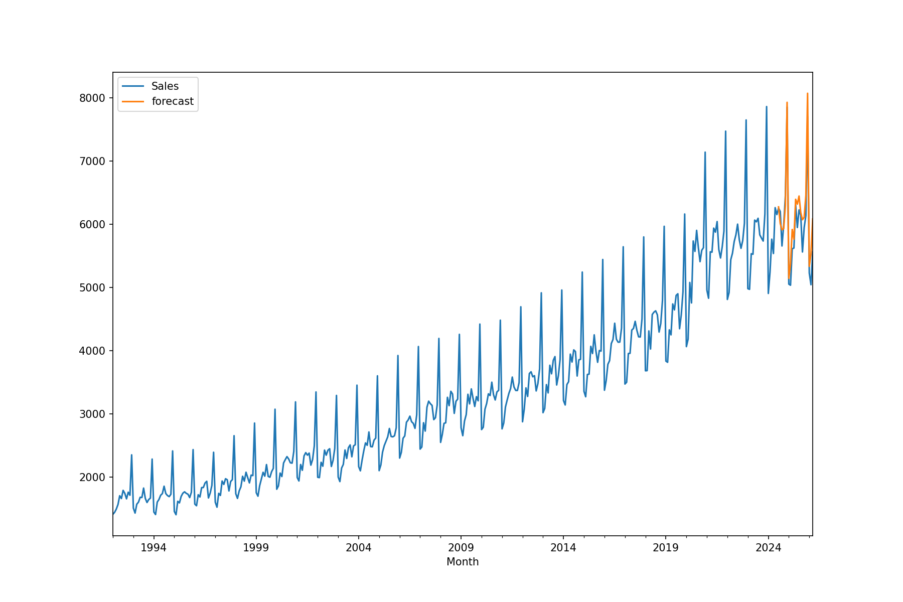
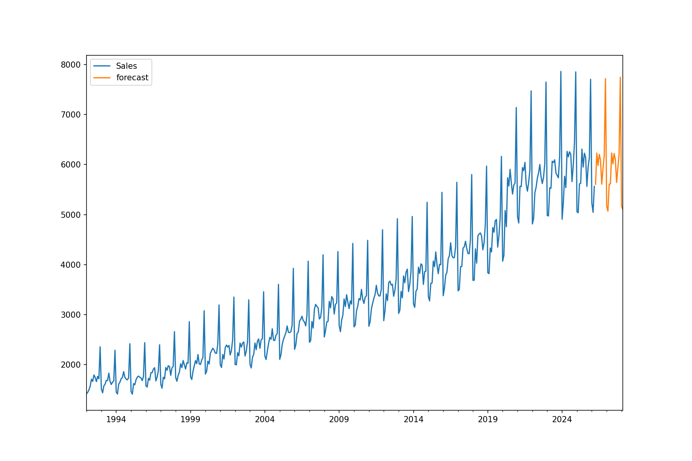

# ARIMA and Seasonal ARIMA Forecasting

A time series analysis of US beer, wine and liquor store retail sales 
(NAICS 4453) using ARIMA and SARIMA models.

## Data

Monthly sales data from the US Census Bureau (FRED), covering January 
1992 to March 2026. Source: MRTSSM4453USN.

## What this project does

- Checks whether the data is stationary using the ADF test
- Applies seasonal differencing to make it stationary
- Uses ACF and PACF plots to identify model parameters
- Fits a SARIMA(1,1,1)(1,1,1)[12] model
- Forecasts future sales

## How to run it

1. Clone the repo
2. Create a virtual environment and install dependencies:
3. Open `notebooks/sarima_analysis.ipynb` and run the cells in order

## Textstack
* numpy
* matplotlib.pyplot
* statsmodels.tsa.stattools as **adfuller**
* statsmodels.api
* pandas.tseries.offsets **DateOffset**

## Results

The model achieves a MAPE of around 4.4% on a 24-month test period, 
with a December 2026 sales forecast of approximately $7.7 billion.

### Raw Series

### Seasonal Difference

### PACF

### Forecast Vs Actual

### Future Forecast

